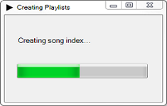
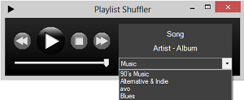
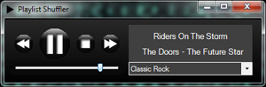
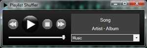

# Playlist Shuffler #

## Summary ##

After extracting out playlists from iTunes, this application is a simple music player in which users can choose a playlist to shuffle.

## Description ##

As powerful as iTunes is, it hogs a ton of memory and uses more CPU than it should sometimes. So I decided to make my own player that can shuffle my iTunes playlists and minimize these complaints of mine. Basically it extracts iTunes playlists, and the user can then select a playlist to shuffle. The player has all the basic features of any reasonable music player, and users can switch playlists at any time. 

Currently, I use [Bass.Net's API](http://www.un4seen.com/) for audio support and extract the iTunes playlists myself with an xml reader. Previously, I used [Ambiera's irrKlang library](http://www.ambiera.com/irrklang/) for audio support and [Eric Daugherty's iTunes Export application](http://www.ericdaugherty.com/dev/itunesexport/) to grab my iTunes playlists. For reasons I'm too lazy to figure out, this application doesn't seem to like other computers, and the thumbnail toolbar's event handlers are completely unresponsive. For now, I'm more than happy with my first C# and .NET application and its performance. 

## Documentation ##

Formal documentation around the classes is stored in the doc folder and can be viewed online [here](https://iliketoprogram14.github.io/MusicPlayerWindow/Index.html).

## Screenshots ##

#### Initial setup ####

#### Choose a playlist ####

#### Playing a song ####

#### Nothing playing ####

